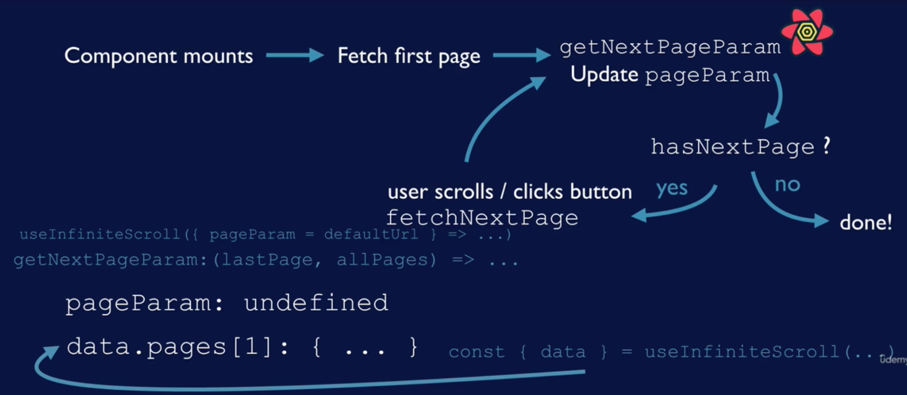

# practice-react-query

[React Query: Server State Management in React](https://www.udemy.com/course/learn-react-query/?couponCode=REACT-QUERY-GITHUB)

- [쿼리 생성 및 로딩/에러 상태](#section-01-쿼리-생성-및-로딩에러-상태)
  - [isFetching vs isLoading](#isfetching-vs-isloading)
  - [React Query Dev Tools](#react-query-dev-tools)
  - [staleTime vs cacheTime](#staletime-vs-cachetime)
- [페이지 매김, 프리페칭과 변이](#section-02-페이지-매김-프리페칭과-변이)

  - [query key](#query-key)
  - [Pagination](#pagination)
  - [prefetching](#prefetching)
  - [Mutation](#mutation)
  - [useMutation](#usemutation)

- ["동적(JIT)"데이터 로드를 위한 무한 쿼리](#section_03-동적jit데이터-로드를-위한-무한-쿼리)

  - [useInfiniteQuery](#useinfinitequery)
  - [useQuery vs useInfiniteQuery](#usequery-vs-useinfinitequery)
  - [useInfiniteQuery Syntax](#useinfinitequery-syntax)
  - [useInfiniteQuery Flow](#useinfinitequery-flow)

- [Section 04. 더 큰 앱에서의 React Query: 설정, 집중화, custom hook](#section-04-더-큰-앱에서의-react-query-설정-집중화-custom-hook)
  - [React Query가 큰 앱에서 사용될 때](#react-query가-큰-앱에서-사용될-때)
  - [React Query의 Custom Hooks](#react-query의-custom-hooks)

# Section 01. 쿼리 생성 및 로딩/에러 상태

> react-query는 기본적으로 sucess아닐 시 세번까지 요청(조정할 수 있다)

## isFetching vs isLoading

### isFetching

- 비동기 쿼리가 해결되지 않았음을 의미

### isLoading

- **isFetching** 하위 집합
- 쿼리 함수가 아직 해결되지 않음(데이터를 가져오는 중), 캐시된 데이터 X

> isFetching, isLoading은 pagination때 구분 잘해야 함

## React Query Dev Tools

- 쿼리 키로 쿼리를 표시해줌
  - 쿼리의 상태를 알려줌(active, unactive, stale)
  - 마지막으로 업데이트된 타임스탬프 알려줌
- 결과 데이터, 쿼리를 볼수 있음
- testing을 위한 것이며, **NODE_ENV === production** 일 시 보이지 않음

## staleTime vs cacheTime

### Stale Data (만료된 데이터)

- 데이터 리페칭(refetching)은 만료된 데이터에서만 실행되며, 데이터 리페칭 실행에는 만료된 데이터 외에도 여러 trigger가 있음
  - ex) 컴포넌트가 다시마운트되거나 다시 포커스 될 때 (단, 만료된 데이터일때만 리패칭됨)

### staleTime

- 데이터가 만료될 수 있는 최대 시간, 즉 **데이터가 만료됐다고 판단하기 전까지 허용하는 시간**
- ex) 10초까지 만료된 데이터 가능 -> staleTime = 10 seconds

### staleTime default가 0인 이유 ?

> 데이터는 항상 만료 상태이므로 서버에서 다시 가녀와야 한다고 가정하기 때문에

### cacheTime

- staleTime === refetching
- cache는 나중에 다시 필요할 수 있는 데이터용
  - 특정 쿼리에 대한 활성 useQuery가 없는 경우 => 해당 데이터는 **cold storge** 로 이동
  - 구성된 cacheTime이 지나면 캐시의 데이터가 만료됨 (유효시간 기본값 5분)
  - cacheTime이 관찰하는 시간의 양은 특정 쿼리에 대한 useQuery가 활성화된 후 경과한 시간
    - 즉, 페이지에 표시되는 컴포넌트가 특정 쿼리에 대해 useQuery를 사용할 시간
  - 캐시가 만료되면 가비지 컬렉션이 실행되고, 클라이언트는 데이터를 사용할 수 X
- 데이터가 캐시에 있는 동안에는 fetching 할 때 사용될 수 있음
  - ex) 데이터가 fetch 될 때 이전 데이터가 존재하면 화면이 빈 페이지로 안보일 수 있음

# Section 02. 페이지 매김, 프리페칭과 변이

## query key

- query에 필요한 param이 있을 때에는 어떠한 트리거가 있어야만 데이터를 다시 가져오게 됨
- ex) 트리거 예시
  - 컴포넌트를 다시 마운트할때
  - 윈도우를 다시 포커스할때
  - useQuery에서 반환되어 수동으로 리페칭을 실행할 때
  - 지정된 간격으로 리페칭을 자동 실행할 때
  - mutation을 생성한 뒤 쿼리를 무효화할 시
  - 클라이언트의 데이터가 서버의 데이터와 불일치할 때

> query key를 이용하여 쿼리별로 캐시를 남겨야 데이터를 다시 가져올 수 있음

```javascript
const { data } = useQuery(["comment", post.id], () => fetchComments(post.id));
```

## Pagination

- 현재 페이지를 파악하는 페이지 매김 스타일
- 페이징은 페이지마다 다른 키가 필요함 `ex) ["posts", currentPage]`
- 유저가 페이지 버튼을 틀릭하면
  - **currentPage** state가 업데이트 됨
  - react query가 바뀐 쿼리 키를 감지
  - 새로운 쿼리를 실행해서 새로운 페이지가 표시됨

## prefetching

> prefetching 목적: 캐시된 데이터를 표시하면서 배경에서는 데이터의 업데이트 여뷰를 조용히 서버를 확인하는 것 => 데이터 업데이되 되면 해당 데이터를 표시에 보여줌

- 데이터를 캐시에 추가하여 구성할 수 있긴 하지만 기본값으로 만료(stale) 상태
- 즉, 데이터에서 사용하고자 할 때 만료상태에서 데이터를 가져옴
- 데이터를 다시 가져오는 중에는 캐시에 있는 데이터를 이용해 앱에 나타냄 (캐시가 만료되지 않았다는 가정하에)
- 추후 사용자가 사용할 법한 모든 데이터에 프리페칭을 사용하는 것이 좋음
  - pagination 뿐만 아니라 다른것들고

## Mutation

- 서버에 데이터를 업데이트하도록 서버에 네트워크 호출을 실시
- day spa경우
  - 변경 내용을 사용자에게 보여주거나
  - 진행된 변경 내용을 등록하여 변경 내용을 사용자에게 보여줄 수 있음
  - 업데이트된 해당 데이터로 react query 캐시를 업데이트 할 수 있음
  - 관련쿼리를 무효화 할 수 있음 -> 서버에서 리페치를 개시하여 클라이언트에 있는 데이터를 서버의 데이터와 최신 상태로 유지하게 됨

## useMutation

- useQuery와 상당히 유사 but
  - mutation이라는 함수를 호출
  - 변경사항을 토대로 서버를 호출할 때 사용
  - 데이터를 저장하지 않으므로 쿼리 키가 필요 x (쿼리가 아닌 변이임)
  - isLoading 있지만 isFetching 없음 (캐시된 항목이 없으므로... )
  - 변이에 관련된 캐시, refeteching 또한 기본값으로 존재하지 x

# section_03. "동적(JIT)"데이터 로드를 위한 무한 쿼리

## useInfiniteQuery

- 다음 쿼리가 뭘지 추적하게 됨
- 이 경우 다음쿼리가 데이터 일부로 반환됨

## useQuery vs useInfiniteQuery

> 반환 객체에서 반환된 데이터 프로퍼티의 형태가 다름

- useQuery에서 데이터: 단순히 쿼리 함수에서 반환되는 데이터
- useInfiniteQuery에서의 객체: 두개의 프로퍼티를 가짐
  - pages
    - 데이터 페이지 객체의 배열인 페이지 페이지에 있는 각 요소가 하나의 useQuery에서 받는 데이터에 해당됨
  - pageParams
    - 각 페이지의 매개변수가 기록되어 있음
    - 많이 사용되지 x
- 모든 쿼리는 페이지 배열에 고유한 요소를 가지고 있고, 그 요소는 해당 쿼리에 대한 데이터에 해당됨 페이지가 진행되면서 쿼리도 바뀜
- pageParams는 검색된 쿼리의 키를 추적함

## useInfiniteQuery Syntax

- **pageParam** 은 쿼리 함수에 전달되는 매개변수
  - 컴포넌트 상태 값의 일부가 아니기 때문에 react query가 pageParam의 현재 값을 유지함

```javascript
useInfinityQuery("sw-people", ({pageParam => defaultUrl}) => fetchUrl(pageParam))
```

## useInfiniteQuery Flow

1. Component mounts

- 이 시점에서는 아직 쿼리를 만들지 않았기 때문에 `useInfiniteQuery`이 반환한 객체의 data 프로퍼티가 정의되어 있지 않음

2. Fetch First Page

- `useInfiniteQuery`가 쿼리 함수를 이용해서 첫 페이지를 가져옴

```javascript
useInfiniteQuery((pageParam = defaultUrl) => ....)
```

- pageParam 인수: 우리가 기본값으로 정의한 것
- pageParam을 이용해 첫번째 페이지를 가져오고 반환 객체 데이터의 페이지 프로퍼티를 설정

```javascript
const { data } = useInfiniteQuery(...)
// data,pages[0] : 첫번째페이지
```

3. getNextPageParam Update pageParam

- 첫번째 데이터가 반환된 후 React Query가 getNextPageParam을 실행
  

# Section 04. 더 큰 앱에서의 React Query: 설정, 집중화, custom hook

## React Query가 큰 앱에서 사용될 때

- fectching과 에러에 대한 인디케이터를 중앙화하고
- 데이터를 refetching하게끔 만들어야함

> 쿼리에서 데이터를 새로 고침하게끔 만들어야 제어할 수 있어야함

- 인증을 진행하기 위해 서버와 통신
- 의존성 qeury
- testing
- ...etc

## React Query의 Custom Hooks

- 다수의 컴포넌트에서 데이터를 엑세스해야하는경우 useQuery 호출을 재작성할 필요 x
- key를 헷갈릴 위험이 x
- 사용하길 원하는 쿼리 함수를 혼동하는 위험 x
- 일반적으로 디스플레이 레이어에서 데이터를 어떻게 가져오는가에 대한 구현을 추상화함
  - ex) 구현을 변경하기로 결정했다면 컴포넌트를 업데이트할 필요 없이 훅을 업데이트 하면 됨

## useIsFetching

- 작은 앱의 경우
  - return 객체에서 isFetching 사용 (useQuery 리턴 객체에서 isFetching의 구조를 분해)
- 더 큰 앱의 경우
  - 어떠한 쿼리가 데이터를 가져오는 중일 때 loading spinner 띄우자
  - useIsFetching은 현재 가져오기 중인 쿼리가 있는지를 알려줌

> 즉, 더이상 각각의 커스텀 훅에 대해 isFetching을 사용할 필요가 x

## QueryClient의 default onError 옵션

- useError 훅은 제공되있지 않음 -> 왜? 존재할수가 없어서
  - 정수 이상의 값이 표시되어야 하기 때문
  - 사용자에게 오류를 표시하려면 각오류에 대한 문자열이 필요 -> 에러메세지는 시시각각변함
- QueryClent를 위해 onError 핸들러 기본값을 만드는게 최선
  - QueryClient의 두가지 옵션객체
  ```javascript
  {
    queries: {useQuery options},
    // query 프로퍼티: useQuery에 추가하는 options 형식의 값을 가짐
    mutations: {useMutation options}
    // mutations 프로퍼티: useMutation에 추가하는 options 형식을 가짐
  }
  ```
